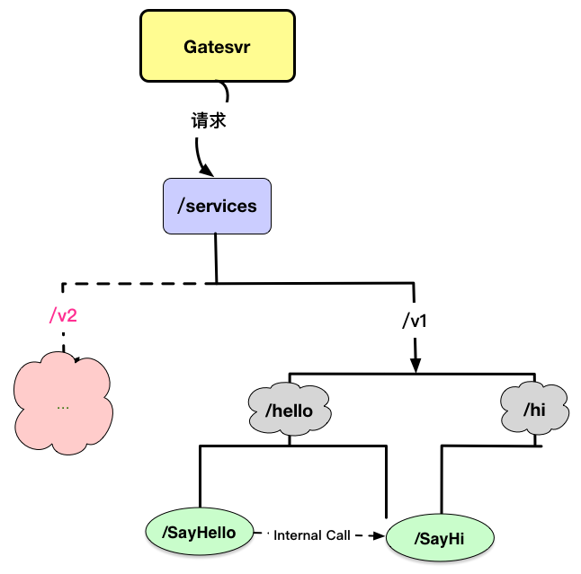

# Iceberg
服务层的统称。iceberg意为冰山，意味着服务层向外部提供简练的接口,来支持各种业务。这些简练的接口就像海面上的冰山一角一样，而隐藏在水面下的则是iceberg体系中众多的服务和数据。

## 关键词
- 高并发
- 分布式
- 多实例负载均衡
- http，tcp，grpc，protobuf
- 水平扩展
- 服务发现(etcd)
- zipkin
- protoc-gen-go

## 源起
在分布式系统中，功能点往往会切分成多个细小的高内聚的独立服务。服务之间通过RPC的方式合作来完成系统的功能。这样一来，各种类型的服务会越来越多，而且每种类型的服务往往都以集群的方式布署，整个系统中的服务实例的数量就更多。这么一来在增加服务横向收缩或者是增减新的服务类型的时候将会对开发和运维带来巨大的工作量。

解决办法是系统提供服务发现机制。统一的整理整个系统的拓扑结构。通过服务的注册和发现机制来降低服务之间的耦合。

## 实现方法
经过调研，决定采用etcd来做为服务发现基础服务。相较于zookeeper, etcd有以下几个优点：

1. 采用go语言开发，官方提供golang sdk。易于开发
2. 运维和布署更简单

Iceberg采用RESTful风格的接口,正好可以天衣无缝的和etcd的树型存储结构配合。各个服务连接到etcd后，通过订阅者模式来感知系统拓扑的变化。

## 服务体系



Iceberg服务体系是一个树形结构，它反映的是RESTful风格的接口组织关系。**除了provider节点外，树中所有的节点都表示一个RESTful接口。**

* provider节点表示它的父节点对应的接口由什么程序实现其功能并提供服务。
provider保存该类型程序的布署情况。有三个子节点：
    - config  Value:是这一类型服务的通用配置
    - name    Value:该类型服务的名称
    - instance  目录节点，它的子节点表示该服务布署的实例
        - 服务实例节点，Key为实例的LISTEN地址(IP:Port); Value为实例在一致性hash环上的hashkey

gatesvr在转发请求时，会按接口树层级进行过滤。也就是说，如果在某个层次上设置了禁用，那么它的子节点的所代表的接口也都会被禁用。但是在接口匹配时，会优先匹配层次更深的接口。这么做的目的是为了能最方便的实现服务降级和服务粒度的拆分。关于服务降级非常容易理解，不再多说。

服务粒度的拆分是考虑可以出现这样的情况，随着业务的发展，一个接口节点可能会细分出很多个子节点，这些子节点的所代表的功能大小不一。这种情况下，我们可以用一个新的服务来处理某一个或者某些节点的接口，剩下的节点继续由老的服务来处理。

* 服务路径生产规则

- [根]/[版本号]/[可选前缀]/[服务名称]/[服务方法]

- 例如
- 服务标识：     /services/v1/hello/hello
- 服务请求路径： /services/v1/hello/hello/SayHello        

## 协议
[Iceberg协议文档.md](https://gitee.com/wlaier/iceberg/blob/master/doc/Iceberg协议说明.md)

## 开发效率

* iceberg 集成了grpc,zipkin 自动生成代码功能,监控服务。只需定义protobuf语法风格的描述文件，即可生成客户端和服务端代码。提升开发效率和精简代码。

## 快速开始

Download and install,go version 1.9+ is required

```
go get gitee.com/wlaier/iceberg
```

- start etcd server([etcd下载地址](https://github.com/coreos/etcd/releases/))
- cd iceberg/demo
- make
- ./gatesvr
- ./s1
- ./s2

```cmd
请使用自己内网IP

curl -H "Content-Type:application/json" -d '{"name":"wlaier"}' 'http://192.168.0.156:3201/services/v1/hello/SayHello'

```

## 服务详细安装步骤
- 1，安装google protoc编译器,下载ETCD
    - [protoc下载地址](https://github.com/google/protobuf/releases/tag/v3.5.0)
    - [protoc安装教程](http://www.jianshu.com/p/0a70eef1bd4a)
    - [etcd下载地址](https://github.com/coreos/etcd/releases/)

* 2，下载相关依赖包

```get
go get github.com/opentracing/opentracing-go
go get github.com/openzipkin/zipkin-go-opentracing
go get github.com/coreos/etcd/clientv3
go get github.com/nobugtodebug/go-objectid
go get github.com/golang/protobuf/proto
```

* 3，编译 proto-gen-go
- 对google proto-gen-go进行修改，增加了irpc插件，生成iceberg需要的代码。

```cmd
    cd iceberg/protoc-gen-go
    go build
    mv protoc-gen-go $GOBIN
```

* 4，编写hello.proto文件,生成客户端服务端代码。

```proto
syntax = "proto3"; // 指定proto版本
package hello;     // 指定包名

// option go_package = "prefix"; 可选前缀

// 定义Hello服务
service Hello {
	// SayHello 定义SayHello方法
	rpc SayHello(HelloRequest) returns (HelloResponse) {}
}

// HelloRequest 请求结构
message HelloRequest {
	string name = 4;
}

// HelloResponse 响应结构
message HelloResponse {
    string message = 1;
}
```

* 5，运行👇命令生成客户端和服务端代码

```
protoc --go_out=plugins=irpc:. *.proto
```

* 6，实现服务端代码(*具体代码，见demo目录*)

```golang
// Hello 对象
type Hello struct {
	transmitid int64
}

// SayHello handel message 01
func (id *Hello) SayHello(ctx context.Context, in *hello.HelloRequest) (*hello.HelloResponse, error) {
	// 开启zipkin 可以使用下面
	// span := opentracing.SpanFromContext(ctx)
	// span.SetTag("SayHello-foo", "bar")
	// span.SetTag("SayHello-time", time.Now().Format(frame.Normalformat))
	var res hello.HelloResponse
	res.Message = "welcome~~~"
	log.Info("SayHello receiver....", ctx.Value("bizid"))
	return &res, nil
}


var (
	cfgFile  = flag.String("config-path", "icetest_conf.json", "config file")
	logLevel = flag.String("level", "debug", "log level")
	logPath  = flag.String("logPath", "", "log path")
)

func main() {
	// 解析命令行参数
	flag.Parse()

	// 设置进程的当前目录为程序所在的路径
	dir, _ := filepath.Abs(filepath.Dir(os.Args[0]))
	os.Chdir(dir)
	var baseCfg config.BaseCfg

	var etcdCfg config.EtcdCfg
	etcdCfg.EndPoints = []string{"http://127.0.0.1:2379"}
	etcdCfg.User = "iceberg"
	etcdCfg.Psw = "123456"
	etcdCfg.Timeout = 3

	var zipkinCfg config.ZipkinCfg
	zipkinCfg.EndPoints = "http://localhost:9411/api/v1/spans"
	baseCfg.Etcd = etcdCfg
	baseCfg.Zipkin = zipkinCfg
	// 直接注册就行了
	pb.RegisterHelloServer(new(Hello), &baseCfg)
}
```

* 7，编译并运行gatesvr，hello，etcd

* 8，
```cmd
curl -H "Content-Type:application/json" -d '{"name":"wlaier"}' 'http://localhost:3201/service/v1/hello/SayHello'
```

## TODO：
- 完善失败重试机制